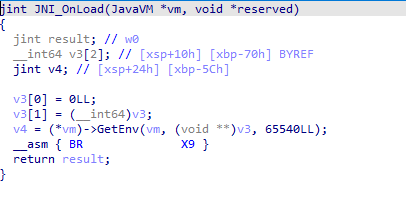
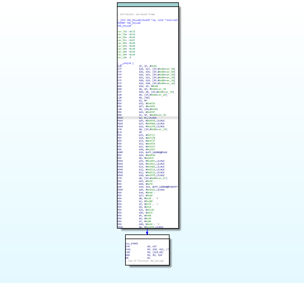
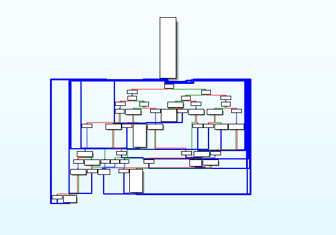
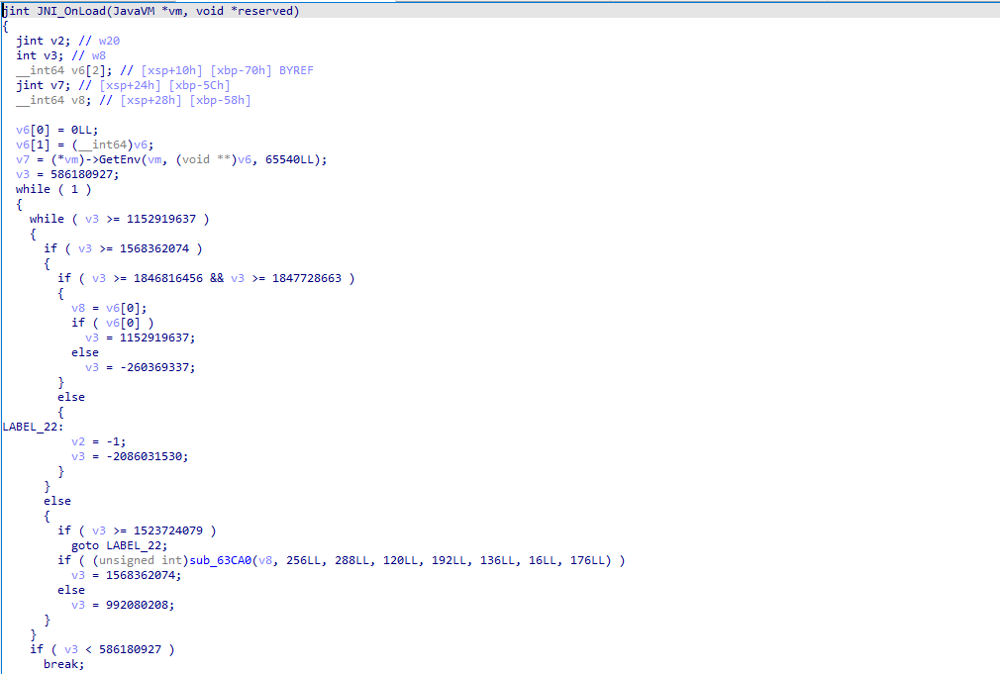
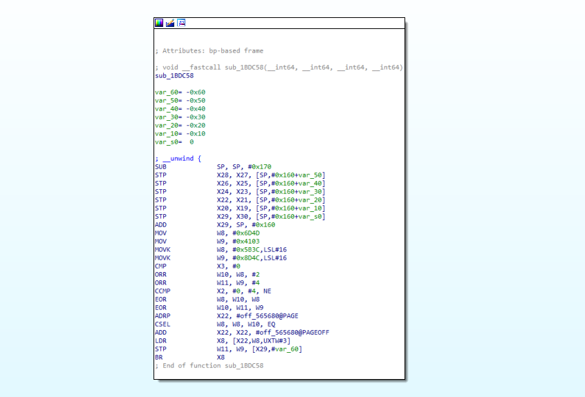
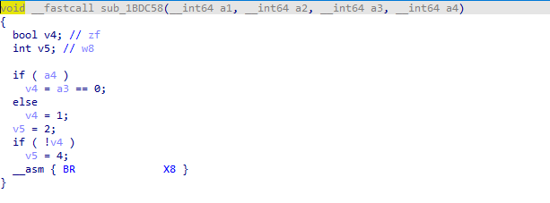
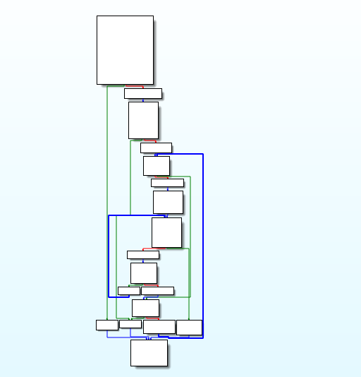
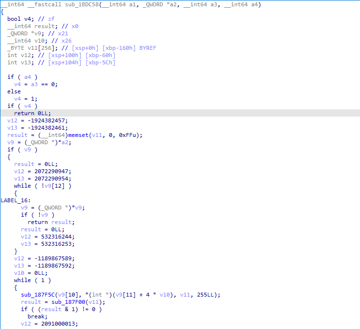

# DeObfBr

使用unicorn去除BR混淆

## 用法
```
usage: debr.py [-h] -f FILE -s START -e END [-o OUTPUT]

options:
  -h, --help            show this help message and exit
  -f FILE, --file FILE  The name of the library.
  -s START, --start START
                        The start address of the function.
  -e END, --end END     The end address of the function.
  -o OUTPUT, --output OUTPUT
                        The output file.
```


## 示例


### libtprt
python debr.py -f libtprt.so -s 63884 -e 63C9C

#### 使用前:

CFG:



F5:




#### 使用后:

CFG:



F5:




### libtersafe
python debr.py -f libtersafe.so -s 1BDC58 -e 1BDE3C

#### 使用前:
CFG:



F5:




#### 使用后:
CFG:



F5:



